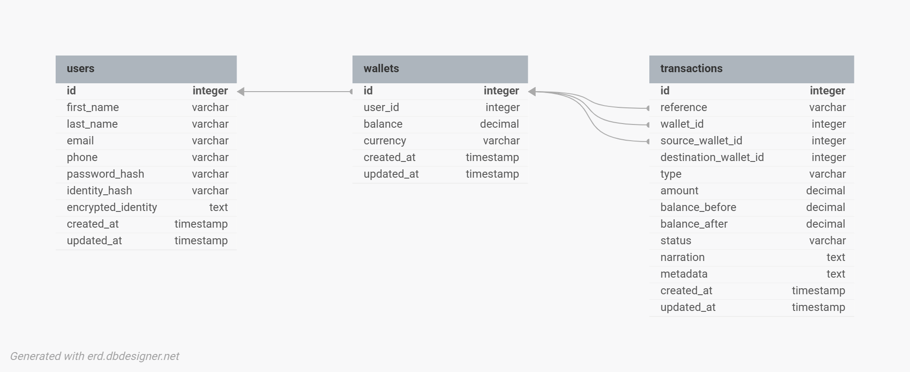

# Lendsqr Backend Engineer Assessment

## Overview

This project is a production-minded implementation of the Demo Credit Wallet API described in the Lendsqr backend engineering assessment. It provides user onboarding, JWT authentication, wallet creation, wallet funding, wallet withdrawal, wallet-to-wallet transfers, transaction history, and blacklist screening through the Lendsqr Adjutor Karma API.

## Business Context

Demo Credit is a lending platform where each onboarded customer owns a wallet. That wallet is used to receive funds, withdraw funds, and transfer money to other users in the system. Because the assessment explicitly emphasizes blacklist checks, database design, and transaction scoping, this implementation treats onboarding safety and money movement consistency as first-class concerns.

## Features Implemented

- User registration with automatic wallet creation
- JWT login and authenticated profile access
- Adjutor Karma blacklist screening during onboarding
- Wallet funding
- Wallet withdrawal
- Wallet-to-wallet transfer by recipient email
- Authenticated transaction history listing
- Swagger API documentation at `/api/v1/docs`
- Jest and Supertest coverage for positive and negative scenarios

## Tech Stack

- Node.js LTS
- TypeScript
- Express
- KnexJS
- MySQL
- JWT
- Zod
- Jest
- Supertest
- Docker and Docker Compose for local MySQL convenience

## Architecture

The code follows a simple layered architecture:

`Route -> Controller -> Service -> Repository -> Database`

Responsibilities are intentionally separated:

- Routes define endpoint paths and middleware composition
- Controllers keep request and response handling thin
- Services own business rules and transaction scoping
- Repositories own database queries
- Shared middleware handles auth, validation, and error translation
- Shared utilities handle money normalization, encryption, references, and response shaping

## Folder Structure

```text
src/
  app.ts
  server.ts
  config/
    database.ts
    env.ts
    swagger.ts
  database/
    migrations/
    seeds/
  modules/
    adjutor/
    auth/
    transactions/
    users/
    wallets/
  shared/
    errors/
    middlewares/
    utils/

tests/
  auth.test.ts
  setup-db.ts
  transfer.test.ts
  wallet.test.ts
  withdrawal.test.ts
```

## Database Design

The core data model is intentionally small and assessment-focused:

- `users`
- `wallets`
- `transactions`

Key design decisions:

- `wallets.user_id` is unique, enforcing one wallet per user
- all money columns use `DECIMAL(19,4)` to avoid floating-point precision problems
- `transactions` stores ledger records for funding, withdrawal, transfer debit, and transfer credit events
- `source_wallet_id` and `destination_wallet_id` are nullable so non-transfer operations remain representable without fake relationships
- `transactions.reference` is unique for traceability
- transfer operations create two transaction rows: one debit for the sender and one credit for the recipient

## ER Diagram



Relationship summary:

```text
users 1 --- 1 wallets
wallets 1 --- many transactions
wallets 1 --- many source transactions
wallets 1 --- many destination transactions
```

## Authentication Approach

The assessment permits faux token authentication. I implemented lightweight JWT authentication as a production-minded extension. The authentication layer is intentionally simple and only exists to identify the user performing wallet operations.

Authentication behavior:

- `POST /api/v1/auth/register` creates the user, creates the wallet, and returns a JWT
- `POST /api/v1/auth/login` validates credentials and returns a JWT
- `GET /api/v1/auth/me` requires a valid bearer token
- protected wallet and transaction routes reject unauthenticated requests

## Adjutor Karma Integration

During onboarding, the service checks the Lendsqr Adjutor Karma blacklist before creating a local user account.

Current approach:

- the registration flow normalizes the user phone number
- the normalized phone number is used for the Karma lookup
- if Adjutor returns a blacklist hit, onboarding is rejected
- if the blacklist check cannot be completed safely, onboarding is blocked for safety

This keeps the implementation aligned with the assessment requirement that blacklisted users should never be onboarded.

## Wallet Transaction Scoping

All balance-changing operations run inside Knex database transactions:

- wallet funding
- wallet withdrawal
- wallet transfer

This is most critical for transfers because two wallet balances and two transaction records are involved. If any part of a transfer fails, the entire database transaction rolls back so balances remain consistent.

## API Endpoints

Base URL:

```text
/api/v1
```

Endpoints:

| Method | Path | Description | Auth |
| --- | --- | --- | --- |
| `POST` | `/auth/register` | Register user and create wallet | No |
| `POST` | `/auth/login` | Authenticate user | No |
| `GET` | `/auth/me` | Get authenticated user profile | Yes |
| `GET` | `/wallets/me` | Get authenticated wallet | Yes |
| `POST` | `/wallets/fund` | Fund wallet | Yes |
| `POST` | `/wallets/withdraw` | Withdraw from wallet | Yes |
| `POST` | `/wallets/transfer` | Transfer to another user | Yes |
| `GET` | `/transactions` | List wallet transactions | Yes |
| `GET` | `/docs` | Swagger UI | No |

Sample requests:

```http
POST /api/v1/auth/register
Content-Type: application/json
```

```json
{
  "firstName": "Smith",
  "lastName": "Omovie",
  "email": "smith@example.com",
  "phone": "2348012345678",
  "password": "Password123"
}
```

```http
POST /api/v1/auth/login
Content-Type: application/json
```

```json
{
  "email": "smith@example.com",
  "password": "Password123"
}
```

```http
POST /api/v1/wallets/fund
Authorization: Bearer <token>
Content-Type: application/json
```

```json
{
  "amount": 5000
}
```

```http
POST /api/v1/wallets/withdraw
Authorization: Bearer <token>
Content-Type: application/json
```

```json
{
  "amount": 2500
}
```

```http
POST /api/v1/wallets/transfer
Authorization: Bearer <token>
Content-Type: application/json
```

```json
{
  "recipientEmail": "user@example.com",
  "amount": 5000,
  "narration": "Wallet transfer"
}
```

```http
GET /api/v1/transactions
Authorization: Bearer <token>
```

Swagger UI is available locally at:

```text
http://localhost:3000/api/v1/docs
```

## Environment Variables

The application expects these environment variables:

```text
NODE_ENV=development
PORT=3000
APP_NAME=demo-credit-api
API_PREFIX=/api/v1
DB_HOST=127.0.0.1
DB_PORT=3306
DB_USER=root
DB_PASSWORD=password
DB_NAME=demo_credit
JWT_SECRET=change-me
JWT_EXPIRES_IN=1d
ADJUTOR_API_KEY=change-me
ADJUTOR_BASE_URL=https://adjutor.lendsqr.com/v2
ENCRYPTION_KEY=12345678901234567890123456789012
```

Use `.env.example` as the starting point for a local `.env`.

## Local Setup

Normal Node.js setup:

```bash
npm install
cp .env.example .env
npm run migrate
npm run dev
```

The API will then be available at:

```text
http://localhost:3000/api/v1
```

Docker support is included for local development convenience. The API can also be run directly with Node.js using the setup instructions above.

If you want MySQL via Docker Compose:

```bash
docker compose up -d mysql
npm run migrate
npm run dev
```

## Running Migrations

Run the latest migrations:

```bash
npm run migrate
```

Rollback the latest batch:

```bash
npm run migrate:rollback
```

## Running Tests

Run the test suite:

```bash
npm test
```

Test setup notes:

- tests run against a dedicated MySQL test database derived from `DB_NAME` with a `_test` suffix
- the test harness creates the test database automatically if it does not exist
- Knex migrations run automatically before the suite executes
- each test truncates `users`, `wallets`, and `transactions` between cases
- local MySQL must be available before running `npm test`

Current test coverage includes:

- register user successfully
- reject duplicate email
- reject blacklisted user
- login user successfully
- reject login with wrong password
- reject unauthenticated wallet access
- get authenticated wallet
- fund wallet successfully
- reject invalid funding amount
- withdraw successfully
- reject withdrawal with insufficient balance
- transfer successfully
- reject transfer to self
- reject transfer to missing recipient
- reject transfer with insufficient balance
- ensure failed transfer does not change balances
- list transactions successfully

## Deployment

Deployment has not been completed yet in this repository state. The intended target is a public Render deployment backed by MySQL, with environment variables configured in the platform dashboard.

Planned reviewer-facing URL shape:

```text
https://<service-name>.onrender.com/api/v1
```

Once deployment is completed, this section should be updated with the live base URL and any platform-specific notes.

## Assumptions

- The wallet currently supports `NGN` by default.
- JWT authentication was implemented as an upgrade over the permitted faux token authentication.
- Adjutor Karma failure blocks onboarding for safety.
- Funding is simulated because no real payment gateway is required.
- Withdrawal is simulated because no bank payout integration is required.
- Transfers use recipient email as the lookup key for the destination wallet.
- Money is stored using decimal-safe database fields and handled with string-safe helpers in business logic.

## Future Improvements

- add idempotency keys for money-moving endpoints
- add refresh token and token revocation support
- add pagination and filtering to transaction history
- add rate limiting, structured audit logs, and stronger observability
- add richer wallet ownership and beneficiary validation rules
- add live deployment and platform health monitoring
