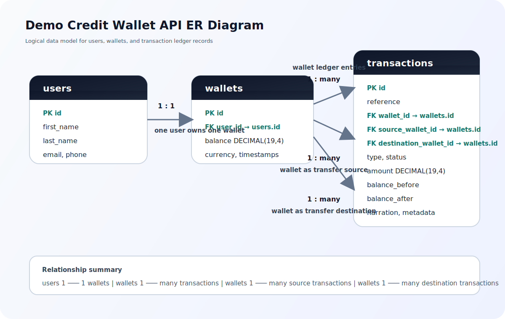

# Lendsqr Backend Engineer Assessment

## Overview

This repository is for a production-minded implementation of the **Demo Credit Wallet API** described in the Lendsqr backend engineering assessment.

The service is intended to support:

- User onboarding
- Authentication
- Wallet creation
- Wallet funding
- Wallet-to-wallet transfer
- Wallet withdrawal
- Transaction history
- Blacklist screening through the Lendsqr Adjutor Karma API

## Business Context

Demo Credit is a lending application where each onboarded user owns a wallet. That wallet is used to receive and move money within the system. The API is designed to model those operations with clear validation, clean service boundaries, and safe database transaction handling.

## Features Implemented

This repository is currently in planning/setup state. The target implementation includes:

- User registration
- Login and authenticated access
- Automatic wallet creation on signup
- Simulated wallet funding
- Wallet withdrawal
- Wallet transfer between users
- Transaction ledger and history
- Adjutor Karma blacklist checks during onboarding
- Unit tests for positive and negative scenarios
- API documentation

## Tech Stack

- Node.js LTS
- TypeScript
- Express
- KnexJS
- MySQL
- JWT authentication
- Jest and Supertest

## Architecture

The intended architecture is a simple layered backend:

`Route -> Controller -> Service -> Repository -> Database`

This keeps responsibilities separate:

- Routes define endpoints
- Controllers handle request/response flow
- Services own business logic
- Repositories own database access
- Shared middleware handles auth, validation, and errors

## Folder Structure

Planned structure:

```text
src/
  app.ts
  server.ts
  config/
  database/
    migrations/
    seeds/
  modules/
    auth/
    users/
    wallets/
    transactions/
    adjutor/
  shared/
    errors/
    middlewares/
    utils/

tests/
```

## Database Design

The core entities are:

- `users`
- `wallets`
- `transactions`

High-level model:

- One user owns one wallet
- One wallet can have many transactions
- Transfer operations create linked debit/credit records

Money values should use `DECIMAL(19, 4)` in MySQL to avoid floating-point precision errors.

## ER Diagram



Relationship summary:

```text
users 1 --- 1 wallets
wallets 1 --- many transactions
wallets 1 --- many source transactions
wallets 1 --- many destination transactions
```

## Authentication Approach

The assessment permits faux token authentication. The target implementation uses lightweight JWT authentication as a production-minded upgrade while keeping the auth layer intentionally minimal.

Authentication goals:

- Protect wallet endpoints
- Identify the acting user
- Avoid unnecessary auth complexity

## Adjutor Karma Integration

During onboarding, the service should query the Lendsqr Adjutor Karma blacklist API before creating a user. If a user is flagged, onboarding should be rejected.

Operational assumption:

- If the blacklist check cannot be completed safely, onboarding should fail closed rather than allow a risky account.

## Wallet Transaction Scoping

All balance-changing operations should run inside database transactions:

- Fund wallet
- Withdraw from wallet
- Transfer between wallets

This is especially important for transfers because both sender and recipient balances must be updated atomically.

## API Endpoints

Planned endpoints:

```text
POST /api/v1/auth/register
POST /api/v1/auth/login
GET  /api/v1/auth/me

GET  /api/v1/wallets/me
POST /api/v1/wallets/fund
POST /api/v1/wallets/withdraw
POST /api/v1/wallets/transfer

GET  /api/v1/transactions
GET  /api/v1/docs
```

Example transfer request:

```http
POST /api/v1/wallets/transfer
Authorization: Bearer <token>
Content-Type: application/json
```

```json
{
  "recipientEmail": "user@example.com",
  "amount": 5000,
  "narration": "Wallet transfer"
}
```

## Environment Variables

Expected environment variables:

```text
NODE_ENV=
PORT=
DB_HOST=
DB_PORT=
DB_USER=
DB_PASSWORD=
DB_NAME=
JWT_SECRET=
JWT_EXPIRES_IN=
ADJUTOR_API_KEY=
ADJUTOR_BASE_URL=
ENCRYPTION_KEY=
```

## Local Setup

Once the implementation exists, local setup should follow this shape:

```bash
npm install
cp .env.example .env
npm run migrate
npm run dev
```

## Running Migrations

Expected command:

```bash
npm run migrate
```

Rollback command:

```bash
npm run migrate:rollback
```

## Running Tests

Expected command:

```bash
npm test
```

Tests should cover:

- Successful registration
- Blacklisted-user rejection
- Duplicate-user rejection
- Successful login
- Auth-protected route access
- Funding, withdrawal, and transfer flows
- Insufficient-balance and invalid-input failures

## Deployment

The target deployment is a public cloud-hosted API, such as Render, with a MySQL database and environment variables configured in the hosting platform.

Expected public URL format:

```text
https://<candidate-name>-lendsqr-be-test.<cloud-platform-domain>
```

## Assumptions

- The wallet uses a single default currency unless multi-currency support is added later.
- Funding and withdrawal are simulated because the assessment does not require external payment or payout integrations.
- JWT authentication is used as a pragmatic improvement over faux-token auth.
- Blacklist screening is mandatory for onboarding.

## Future Improvements

- Add refresh-token support
- Add idempotency keys for money-moving endpoints
- Add rate limiting and audit logging
- Add background jobs for external integrations
- Add stronger observability and production monitoring

## Current Repository State

At the moment, this repository contains planning and assessment-alignment documentation only. The application code, migrations, tests, Swagger setup, and deployment configuration still need to be implemented.
